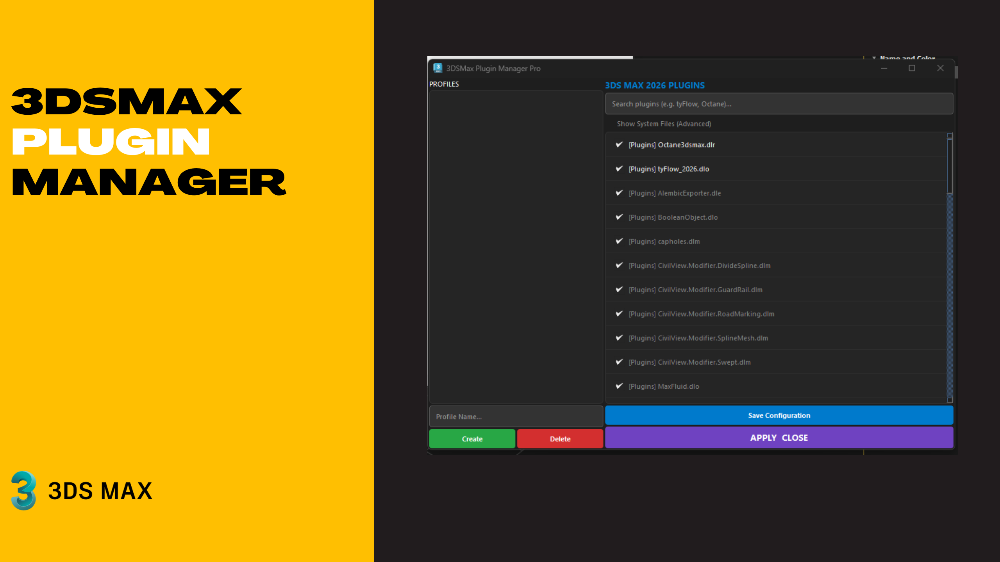

# 🚀 3DS Max Plugin Manager Pro
**A Professional, Dark-Themed Plugin & Profile Manager for 3ds Max 2025+**

3ds Max Plugin Manager Pro is a powerful Python-based tool designed for 3D artists and technical directors to manage their 3ds Max environment with ease. It allows you to toggle plugins, create custom profiles for different workflows (e.g., Rendering, Simulation), and keep your startup clean.
Developed by: **Iman Shirani**

[](https://www.paypal.com/donate/?hosted_button_id=LAMNRY6DDWDC4)


---

## ✨ Key Features

* **Auto-Version Detection**: Automatically detects if you are running 3ds Max 2025 or 2026 using the `rt.maxversion()` API and scans the correct directories.
* **Professional Dark UI**: A sleek, modern interface styled after high-end DCC tools with custom purple and charcoal accents.
* **Smart Filtering**: Toggle "Advanced Mode" to see system-level files or keep it simple to focus only on main plugins like Octane and tyFlow.
* **Profile Management**: Create, save, and delete plugin configurations for different project needs.
* **Real-time Search**: An instant search bar to find any plugin across multiple system paths in seconds.

---

## 🛠 Tech Stack

* **Language**: Python 3.x (3ds Max Internal Python)
* **Framework**: PySide6 (Qt for Python)
* **API**: `pymxs` for deep integration with the 3ds Max environment and settings.

---

## 🚀 Installation & Usage

1.  **Clone the Repository**:
    ```bash
    git clone [https://github.com/imanshirani/3dsMax-Plugins-Manager-Pro.git](https://github.com/imanshirani/3dsMax-Plugins-Manager-Pro.git)
    ```
2.  **Run in 3ds Max**:
    * Open 3ds Max (Run as **Administrator** to allow file renaming in Program Files).
    * Go to `Scripting` -> `Run Script...`
    * Select `launch.py` from the project folder.
3.  **Pro Tip**: You can create a custom toolbar button or drag and drop `launch.py` into the viewport for faster access!

---

## 📂 Project Structure

* `launch.py`: The main controller that handles the logic, button connections, and profile switching.
* `UI.py`: Defines the modern PySide6 layout and user interface components.
* `pluginmanager.py`: The core logic engine that handles version detection, file scanning, and `.ini` file updates.
* `style.py`: Contains the complete QSS (Qt Style Sheets) for the professional dark theme.

---

## ⚠️ Requirements

* **3ds Max 2025** or **2026** (Supports the latest plugin package structures).
* **Write Permissions**: Ensure you have administrative rights to enable/disable plugins located in `C:\Program Files`.

---

## 🤝 Contributing
Contributions are welcome! If you have ideas for new features like cloud profile syncing or automated backup, feel free to open an issue or submit a pull request.

---
**Developed by Iman Shirani**
